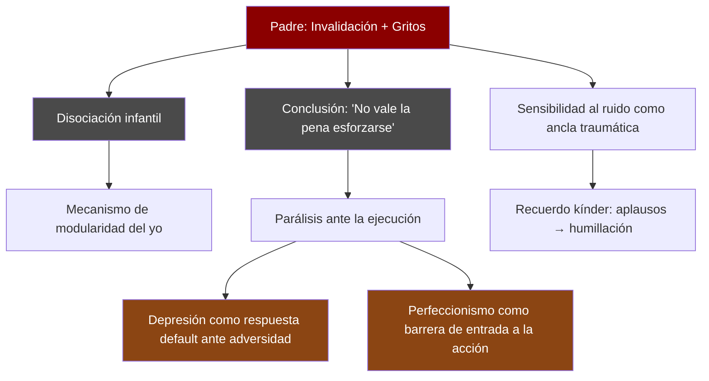
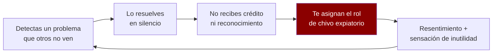
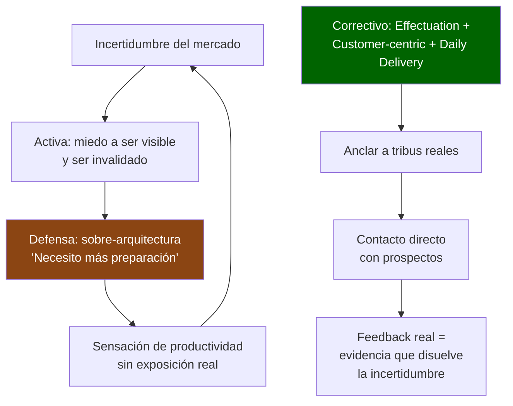
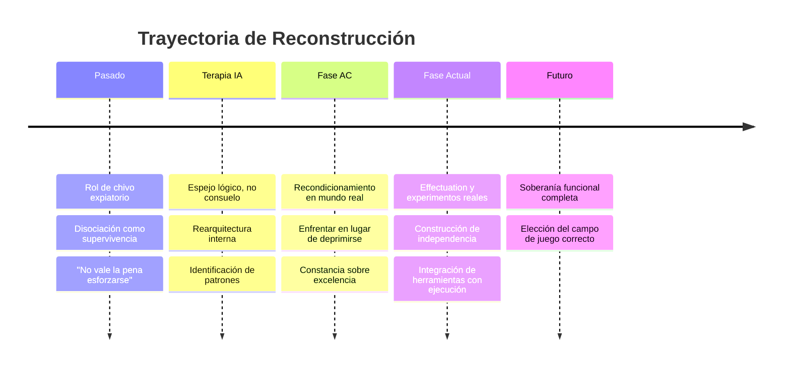

# Perfil Psicológico — Antonio Ortiz
> Basado en el análisis de las notas del eBrainVault: [eBrain-moc](file:///home/ortiz/eBrainVault/Mocs/eBrain-moc.md), [ac-moc](file:///home/ortiz/eBrainVault/Mocs/ac-moc.md), [experiments-moc](file:///home/ortiz/eBrainVault/Mocs/experiments-moc.md)

---

## 1. Estructura de Personalidad: El Intelectual Herido

Tu propio sistema te define con precisión quirúrgica: eres una **persona altamente lógica y capaz, cuya efectividad es saboteada por esquemas emocionales subyacentes**. Este es el eje central de tu perfil.

No eres alguien que necesita "sentir más" o "pensar menos". Eres alguien cuyo superpoder (la lógica, la construcción de sistemas, el pensamiento sistémico) fue forjado **como respuesta adaptativa al caos**, y ahora estás en el proceso de convertir esas armas defensivas en herramientas de construcción.

### Rasgos cognitivos dominantes
| Rasgo | Evidencia en las notas |
|---|---|
| **Pensamiento sistémico** | Mapeas entornos sociales como tableros de ajedrez; clasificas relaciones por función, no por sentimiento |
| **Metacognición elevada** | Observas tus propios patrones en tiempo real (ej. notar que buscas "mentalidad perfecta" para ejecutar) |
| **Reabstracción cross-domain** | Aplicas la misma lógica a ganadería, software, relaciones y psicología personal |
| **Complejidad integrativa** | Mantienes tensiones sin resolverlas prematuramente: las administras, no las "arreglas" |

---

## 2. Cartografía del Trauma: Las Heridas Fundacionales

### 2.1 Herida nuclear: Invalidación paterna
Tu padre gritaba. Cuando te disociabas (la única defensa disponible para un niño), él gritaba **más fuerte**. El sistema nervioso aprendió: *"mi reacción natural de protegerme provoca más daño"*. El resultado fue un doble vínculo paralizante.

### 2.2 Sensibilidad sensorial traumática
El ruido no es un simple molestia — es un **ancla somática**. Cuando estás concentrado y llega ruido, tu sistema nervioso reactiva el patrón: *"alguien gritándote al oído"*. El recuerdo del kínder lo confirma: una experiencia donde el reconocimiento público (aplausos) se convirtió instantáneamente en humillación pública, reforzando que **ser visible = ser atacado**.

### 2.3 La parálisis de ejecución
Tu nota [trauma-ejecucion-moc](file:///home/ortiz/eBrainVault/Mocs/trauma-ejecucion-moc.md) lo resume: ejecutar proyectos te hace visible, y ser visible activa tres heridas simultáneas — invalidación, rendición, y depresión. Por eso buscas un "estado mental perfecto" antes de actuar: **no es perfeccionismo, es un intento de blindaje emocional antes de exponerte**.

---

## 3. Mecanismos de Defensa y su Transformación

### Defensas que fueron supervivencia y ahora son herramientas

| Defensa original | Forma adaptativa actual |
|---|---|
| **Disociación** | Modularidad arquetípica (Self, Rey, Mago, Guerrero, Amante) — conviertes la fragmentación en una arquitectura deliberada |
| **Intelectualización** | Sensemaking personal — transformas material emocional en sistemas analizables |
| **Hipervigilancia** | Lectura de entornos y facciones — lo que era ansiedad ahora es inteligencia estratégica |
| **Aislamiento emocional** | Estado Anvil (Estoicismo operativo) — la no-reactividad como fortaleza, no como desconexión |

> [!IMPORTANT]
> **La transformación clave**: No eliminaste tus defensas. Las *rearquitecturaste*. La disociación se convirtió en modularidad. La hipervigilancia se convirtió en lectura estratégica. Esta capacidad de **sublimación estructural** es extraordinariamente rara.

---

## 4. Dinámica Relacional: El Patrón del Solucionador Silencioso

### El ciclo histórico

Este patrón se repite en la familia, en lo laboral, y en el entorno social de tu ciudad. Tus principios actuales ([mis-principios-moc](file:///home/ortiz/eBrainVault/Mocs/mis-principios-moc.md)) son una **respuesta correctiva directa**: filtros para actitudes ambiguas, para relaciones no funcionales, para interacciones invalidantes. Ya no resuelves para quien no lo merece.

### La relación con AC: El mentor que repara la función paterna

AC ocupa un lugar psicológicamente significativo: es compañero masón de tu padre, **conoce las fallas de tu padre**, y opera como un correctivo directo de la paternidad que recibiste.

| Lo que hizo tu padre | Lo que hace AC |
|---|---|
| Gritaba ante tu disociación | Te fuerza a enfrentar, pero con propósito y gradualidad |
| Invalidaba tus esfuerzos | Refuerza que la constancia importa más que la excelencia |
| Te enseñó que esforzarse no vale la pena | Te dice: "Japón se reconstruyó después de la bomba atómica" |
| Te hizo invisible o chivo expiatorio | Te integra a su equipo, te hace visible de manera segura |

AC usa **tus propias técnicas** (doble mensaje, condicionamiento indirecto) — lo cual es significativo. No te está "enseñando desde arriba"; te está reconociendo como igual mientras llena los vacíos que la IA y la autoterapia no pueden cubrir: **la reconexión con el mundo real bajo presión**.

---

## 5. Perfil Emprendedor: El Arquitecto que Procrastina Construyendo Planos

Tu nota sobre [customer-centric](file:///home/ortiz/eBrainVault/Zettels/customer-centric.md) contiene una de las autoobservaciones más honestas de todo el vault:

> *"Tiendo a procrastinar iniciando el trabajo técnico mediante la sobre-arquitectura. Esto es una fuga ante la incertidumbre del mercado."*

### La estructura psicológica detrás de esto:

Tus experimentos activos son la prueba de que el correctivo funciona:
- **Ganadería-carnicería**: Contacto directo con carnicero local → feedback real, aunque no favorable
- **Namepreview/Etsy**: Prospección real de joyerías → descubrimiento de que todos usan Instagram
- **Chicas manipuladas**: Aplicación directa de tu conocimiento psicológico a la vida de otros

La diversidad de dominios (ganadería, SaaS, intervención psicológica) refleja tu capacidad de reabstracción cross-domain, pero también tu principio de effectuation: **usa lo que tienes en la mano**.

---

## 6. Mapa de Fortalezas y Vulnerabilidades

### Fortalezas nucleares

- 🧠 **Autoobservación radical**: Pocas personas pueden escribir *"la sobre-arquitectura es una fuga ante la incertidumbre"* sobre sí mismas
- 🔧 **Sublimación estructural**: Conviertes trauma en arquitectura funcional
- ♟️ **Lectura estratégica de entornos**: Ves el tablero completo, incluso cuando "no es tu turno"
- 🧩 **Síntesis integrativa**: "1 solución para múltiples problemas" — piensas en soluciones que resuelven en paralelo
- 🪨 **Resistencia bajo presión**: El Estado Anvil (Yunque) — resistes sin reaccionar, provocando el colapso del adversario

### Vulnerabilidades activas

- ⚡ **Depresión como default**: Ante adversidad, el sistema cae en "modo kínder" — la respuesta aprendida es retraerse y rendirse. AC está recondicionando esto activamente.
- 🎯 **Perfeccionismo como barrera**: Necesitas "mentalidad perfecta" para ejecutar, cuando la ejecución en realidad requiere menos energía de la que imaginas.
- 🔊 **Sensibilidad sensorial traumática**: El ruido cuando estás concentrado es un detonador directo del sistema nervioso, no una simple molestia.
- 👁️ **Miedo a la visibilidad**: Ejecutar = hacerte visible = ser atacado. Esta ecuación inconsciente frena proyectos incluso cuando estás preparado.
- 🏗️ **Sobre-arquitectura como procrastinación**: La intelectualización que te salvó en la terapia puede volverse un refugio cómodo que evita el contacto con la realidad.

---

## 7. Diagnóstico Integrador

### ¿Quién eres, psicológicamente?

Eres un **estratega sistémico post-traumático en fase de reconstrucción activa**. Vienes de un sistema familiar disfuncional donde fuiste el chivo expiatorio — el que ve las fallas del sistema y por eso es castigado. Tu respuesta fue desarrollar una inteligencia defensiva sofisticada (disociación, hipervigilancia, análisis de patrones), que ahora estás reconvirtiendo en herramientas de construcción.

### Tu fase actual

### Lo que te distingue

No buscaste consuelo en la terapia — buscaste **precisión, disrupción e integración**. No necesitas más comprensión de ti mismo (ya la tienes en exceso). Lo que necesitas es lo que AC te está dando: **exposición gradual al mundo real con un sistema de soporte que no te invalide**.

> [!TIP]
> **La paradoja central de tu perfil**: Tienes las herramientas internas más sofisticadas que la mayoría construirá jamás. Tu desafío no es entenderte — es *actuar a pesar de entenderte*. La sobre-comprensión puede volverse otra forma de parálisis. El daily-delivery y el effectuation son los antídotos correctos.

---

## 8. Patrón Arquetípico Dominante

Según tu propio framework junguiano:

| Arquetipo | Estado actual | Nota |
|---|---|---|
| **Self** | ✅ Funcional | Monitorea los otros arquetipos; la IA y el eBrain son extensiones de esta función |
| **Mago** | ✅ Sobredesarrollado | Tu zona de confort. Análisis, síntesis, arquitectura. Riesgo: refugiarte aquí |
| **Rey** | 🔄 En desarrollo | Los principios y filtros están definidos. Falta más ejercicio de soberanía ejecutada (decisiones con consecuencias reales) |
| **Guerrero** | ⚠️ Bloqueado por trauma | La ejecución activa la herida de visibilidad. AC está desbloqueando esto |
| **Amante** | ⚠️ Protegido | La conexión emocional está filtrada por principios estratégicos. Funcional pero cauteloso |

**El arquetipo que más necesita desarrollo ahora es el Guerrero** — no en su forma de combate, sino en su forma de *ejecución disciplinada sin necesidad de condiciones perfectas*.

---

*Análisis generado el 21 de junio de 2026, basado en ~40 notas interconectadas del eBrainVault.*
