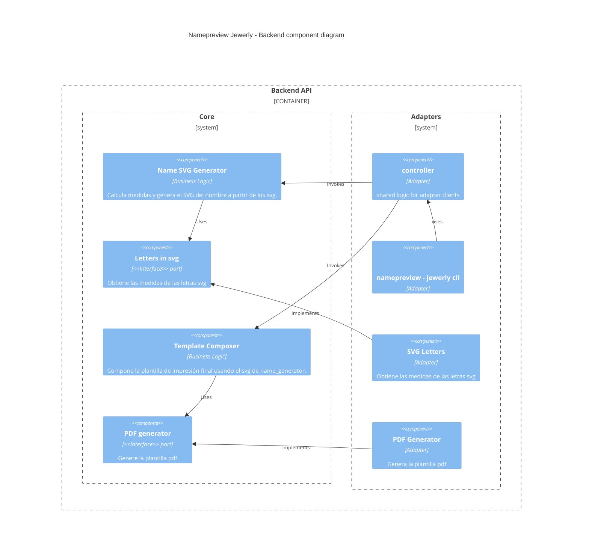

---

# namepreview Jewerly dev c4 component diagram

```mermaid
C4Component
    title Namepreview Jewerly - Backend component diagram
    
    Container_Boundary(backend, "Backend API"){
		Boundary(core_boundary, "Core") {
		
			Rel(name_generator, svg_letters_port,"Uses")
	        Component(name_generator, "Name SVG Generator", "Business Logic", "Calcula medidas y genera el SVG del nombre a partir de los svg.")
	        Component(svg_letters_port, "Letters in svg", "<<Interface>> port", "Obtiene las medidas de las letras svg")
	        
	        Component(template_generator, "Template Composer", "Business Logic", "Compone la plantilla de impresión final usando el svg de name_generator.")
	        Component(pdf_generator_port, "PDF generator", "<<Interface>> port", "Genere la plantilla pdf")
	        
	        Rel(template_generator, pdf_generator_port, "Uses")
        }
        
        Boundary(adapters_boundary, "Adapters"){
        	Component(controller, "controller", "Adapter", "shared logic for adapter clients")
        	Rel(controller, name_generator, "Invokes")
        	Rel(controller, template_generator, "Invokes")
	        Component(cli, "namepreview - jewerly cli", "Adapter" , "cli para usar np jewerly")
	        Rel(cli, controller, "uses")
	        Component(svg_letters_adapter, "SVG  Letters", "Adapter", "Obtiene las medidas de las letras svg")
	        Component(pdf_generator_adapter, "PDF Generator", "Adapter", "Genera la plantilla pdf")
	        Rel(svg_letters_adapter, svg_letters_port, "Implements")
            Rel(pdf_generator_adapter, pdf_generator_port, "Implements")
        }
        
    }
    

```

---

## Connections:
- [[]]

---

## Questions for Further Exploration:
- 