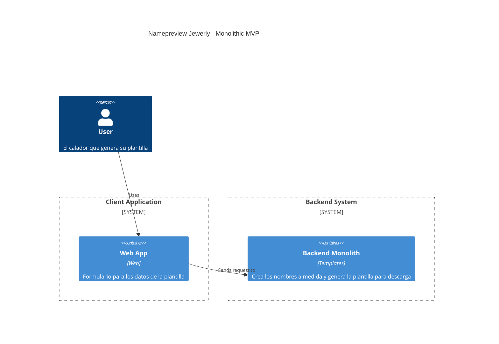

---

# namepreview jewerly dev c4 container diagram

```mermaid
C4Container
    title Namepreview Jewerly - Monolithic MVP

    Person(user, "User", "El calador que genera su plantilla")

    System_Boundary(client_system, "Client Application") {
        Container(web, "Web App", "Web", "Formulario para los datos de la plantilla")
    }
    
    System_Boundary(backend_system, "Backend System") {
        Container(backend, "Backend Monolith", "Templates", "Crea los nombres a medida y genera la plantilla para descarga")
    }

    Rel(user, web, "Uses")
    Rel(web, backend, "Sends request to")
```

---

## Connections:
- [[]]

---

## Questions for Further Exploration:
- 