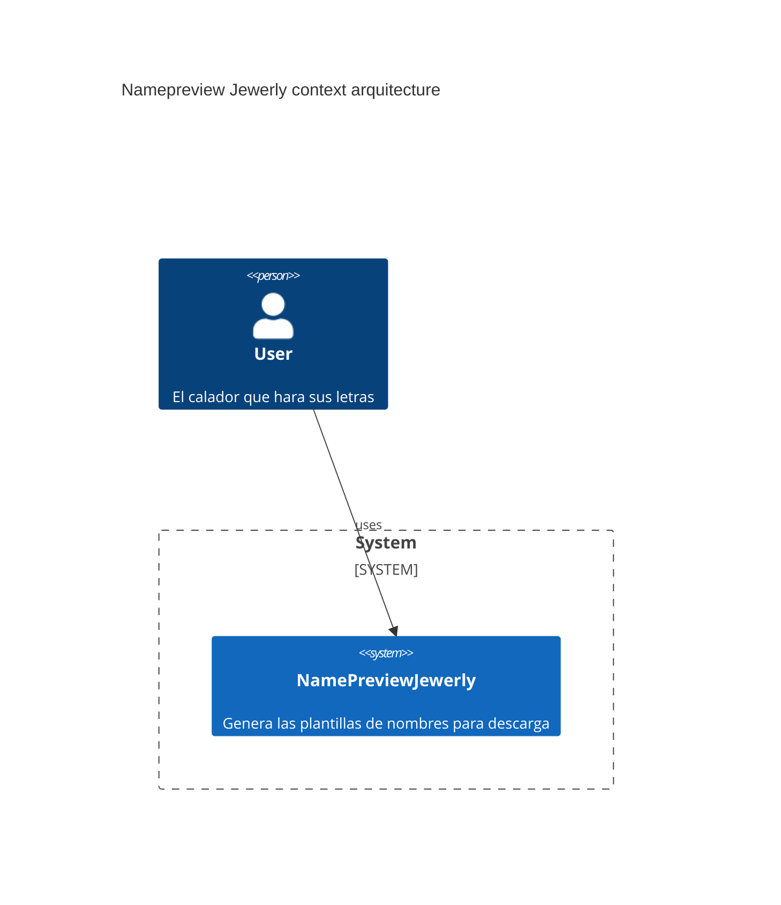

---

# namepreview jewerly dev c4 context diagram

---

## Connections:
- [[]]

---

## Questions for Further Exploration:
- Roles de usuarios
- Compra de letras
- Definir si el calador podra usar libremente los creditos de letras