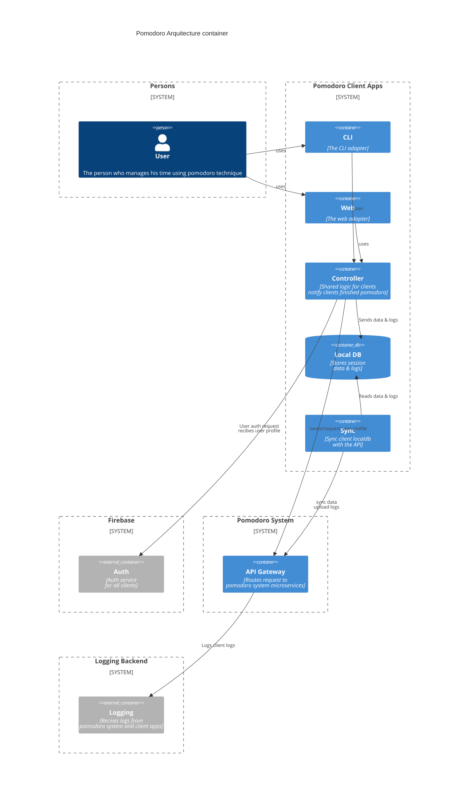
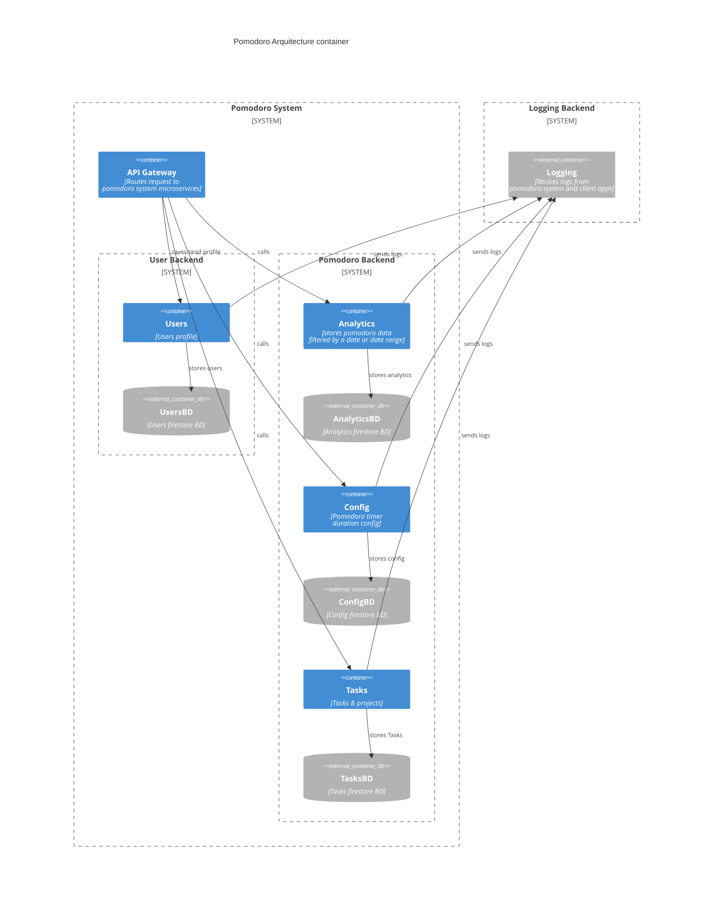

---

# Pomodoro Arquitecture Diagram c4 container
 

## C4 Client component

## Backend c4 container diagram

# More info
- Arquitectura offline-first
## Client
- Stores and reads session in localDB
- The local pomodoro config will be used on client and synced in microservices
### Sync
- syncs between localDB and microservices
- Client components have his own timestamp: So all the events for diferent clients can be synced without problems, using Last-write-wins

## Backend
- Al microservices stores the uuid that the client send
- firebase for store the db
### Analytics
- Stores pomodoro duration, started and ended timestamp, message
- Filter by start / end timestamp

## Config
- microservice for store user config for sync between different clients

### Logging
- Recives pomodoro system microservices logs
- Recives logs from clients:
	- clients store logs on localBd
	- sync reads logs from bd 
	- sync sends logs to APIGateway
	- APIGateway sends logs to logging microservice

---

## Connections:
- [[]]

---

## Questions for Further Exploration:
- 