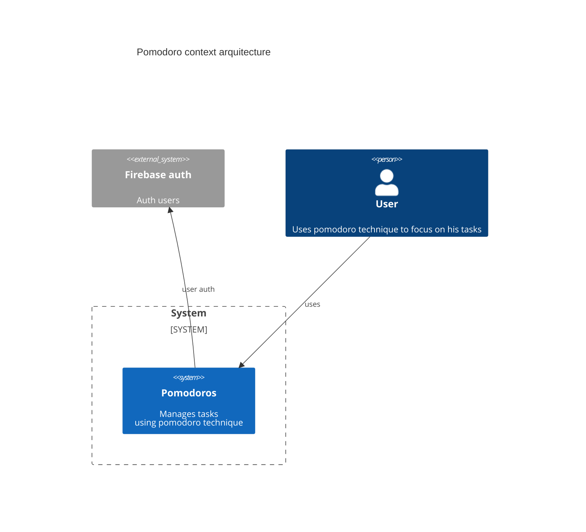

# Pomodoro Arquitecture diagram c4 context 
C4 System diagram 

```mermaid
C4Context
    title Pomodoro context arquitecture
    
    System_Ext(fcm_auth, "Firebase auth", "Auth users")
    
    Person(User, "User", "Uses pomodoro technique to focus on his tasks")
    
    System_Boundary(System, "System"){
    System(Pomodoro, "Pomodoros", "Manages tasks <br> using pomodoro technique")
    }
    
    Rel(User, Pomodoro, "uses")
    Rel(Pomodoro, fcm_auth, "user auth")
    
```

## Notas
[[Zettels/adr-backend|adr-backend]]