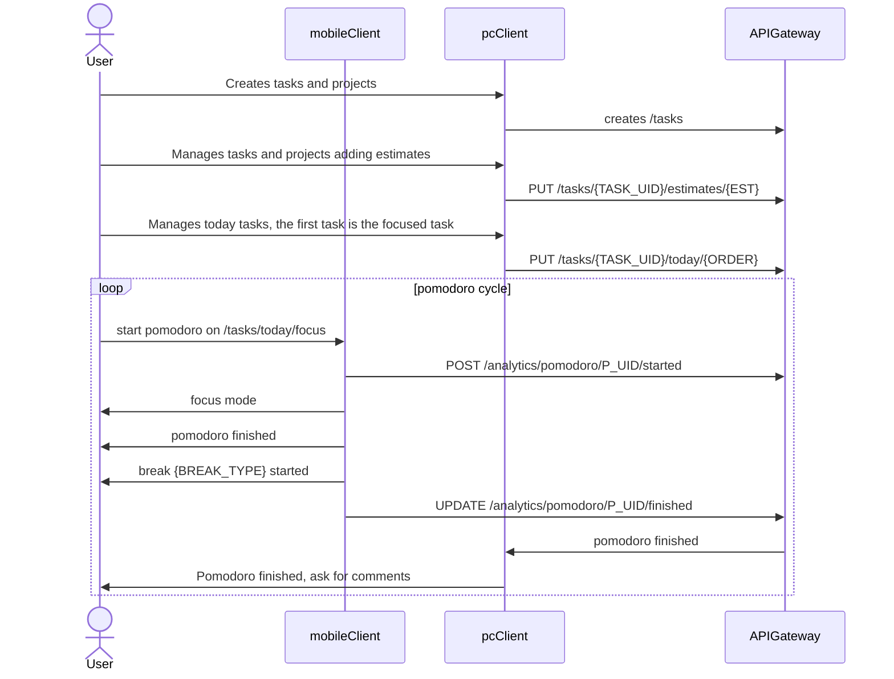

---

# Pomodoro Diagram Sequence
The pomodoro app is designed to work with two screens:
## Focus screen
- Ideally used on a cellphone, tablet or small monitor, but It can be used on a different tab
- No interruption: Tell people when you are working, or when you are on a break.
- Focus: Remember at what are you working and pomodoris used
- Analytics: View day, week and month analytics of used pomodoris by task or grouped by project

## Tasks screen
- Ideally used on pc, is easy to write tasks and comments,  but tablet and phone will be supported, the diagram will be assume the client uses pcClient
- Create / update tasks
- Write comments on tasks, when the pomodoro is finished

For clarity purposes the diagram will be assume the user is using focus screen on his mobile device.

---

### Todo
- El usuario puede ver la planeacion completa de su proyecto y escribir cuantas horas a la semana trabajara para tener estimacion de tiempo terminado

## Connections:
- [[]]

---

## Questions for Further Exploration:
- Creo el microservicio de tasks y projects o creo servicios para conectar todoist, google keep o similares?